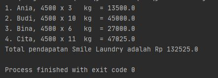
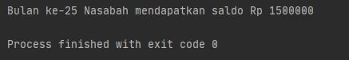
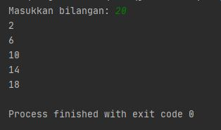

# Laporan Praktikum Pertemuan 1

## Output Program
Pada pertemuan 1 mata kuliah "Algoritma dan Struktur Data" terdapat penugasan tentang Dasar Pemrograman untuk me-review kembali pada semester pertama.

1. Pada tugas 1 terdapat soal untuk membuat program tentang pendapatan "Smile Laundry" setelah 4 orang pengunjung memakai jasa laundry-nya. Di bawah ini hasil dari keluaran programnya, yaitu total pendapatannya senilai Rp 132,525,00 

    

2. Pada tugas 2 terdapat soal untuk membuat program tentang menentukan bulan ke berapa saldo seorang nasabah dapat mencapai Rp 1,500,000? Setelah dikerjakan dalam pembuatan program, dapat diketahui pada bulan ke-25 saldo nasabah tersebut mencapai Rp 1,500,000

    

3. Pada tugas 3 terdapat soal untuk membuat program tentang menampilkan bilangan genap kecuali bilangan tersebut kelipatan 4. Di bawah ini user menginputkan bilangan sampai berapa deret bilangan ditampilkan. Program ini menggunakan looping.

    

3. Pada tugas 4 terdapat soal untuk membuat program tentang menghitung bangun datar yang telah dibuatkan dalam fungsi/method di kode programnya. Program ini menyuruh user untuk memilih angka 1-3 dalam memilih bangun datar yang ingin dilakukan penghitungan.

    

    Terima kasih :D
