# Laporan Praktikum Pertemuan 10
Maulana Bintang Irfansyah_TI-1H
## Jawaban untuk Pertanyaan 8.2.3

1. Karena isinya kosong untuk atrian pertama dan terakhir sehingga belum dapat ditentukan isinya, maka front = rear = -1. -1 digunakan untuk front dan rear agar tidak merujuk ke antrian berapa pun karena jika front = rear = 0, maka ada antrian di dalam queue-nya.

2. Kegunaan rear == max -1 adalah untuk kondisi dimana kita sudah menambahkan banyak data, misalnya terdapat 4 data yang telah dimasukkan, kemudian 3 data dihapus, sehingga tersisa 1 data yang dilihat di alokasi memori data tersebut berada di paling belakang. Jadi, data tersebut dapat diisi, dan harus diletakkan di bagian depan tanpa mengubah posisi front dan rear-nya.

3. Data baru disimpan pada posisi terakhir dalam queue yaitu pada potongan program

    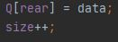   

4. Data yang dikeluarkan adalah data yang paling depan ditunjukkan pada potongan program

    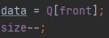 

5. front == max -1 kegunaannya adalah jika terdapat elemen yang sudah mencapai maksimum, lalu dihapus beberapa akan muncul penambahan data baru, kemudian data lama akan dihapus, sehingga front-nya harus merujuk ke indeks yang terbaru / ke-0.

6. Pada method print sintaks int i = front digunakan untuk menentukan nilai front-nya, dimana nilai front-nya dimasukkan ke dalam sebuah variabel i.

7. Maksud dari i = (1 + 1) % max; untuk nilai i nantinya akan maju, dimana variabel i nanti akan mengecek mulai dari front sampai rear. Dari setiap langkah yang dituju selama nilainya belum mencapai nilai sisa bagi terhadap max itu sama dengan 0, maka nilai dapat dicetak.

## Jawaban untuk Pertanyaan 8.3.3

1. Fungsi kode program tersebut untuk memberitahu bahwa parameter dari class penumpang akan diisi, tetapi dengan memberikan "" dan 0 untuk awalannya.

2. Kode program bila diganti menjadi Penumpang data = new Penumpang() akan membuat error atau tidak dapat dijalankan. Karena parameter tidak diinisialisasi di awalannya, sehingga program tidak dapat dijalankan.

3. Data yang dikeluarkan adalah data yang paling depan ditunjukkan pada potongan program

    .

4. Modifikasi Program

    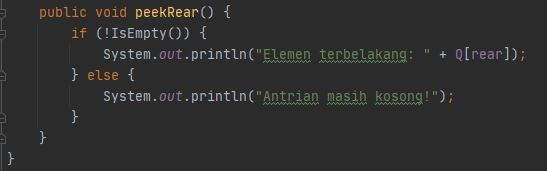

    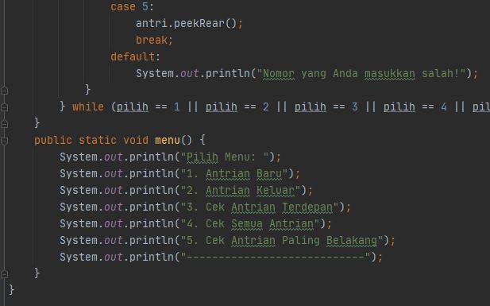 

## Output Program Praktikum
Pada pertemuan 10 mata kuliah "Algoritma dan Struktur Data" terdapat penugasan tentang "Queue".

1. Pada tugas 1 terdapat soal untuk menambahkan dua method ke dalam class Queue pada praktikum 1. Berikut di bawah ini gambar penambahan dua method untuk menampilkan posisi dari sebuah data di dalam qeueue dan untuk menampilkan data yang berada pada posisi tertentu.

    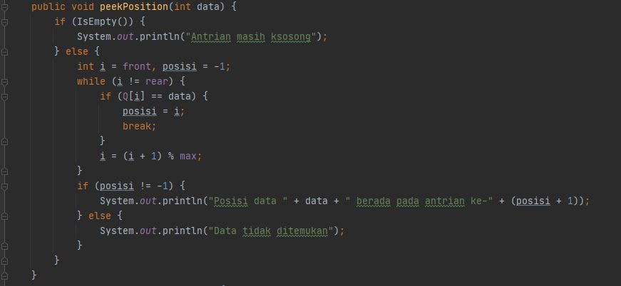

    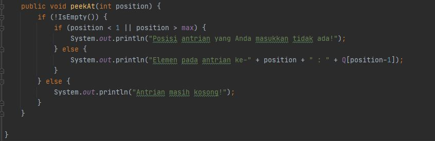

    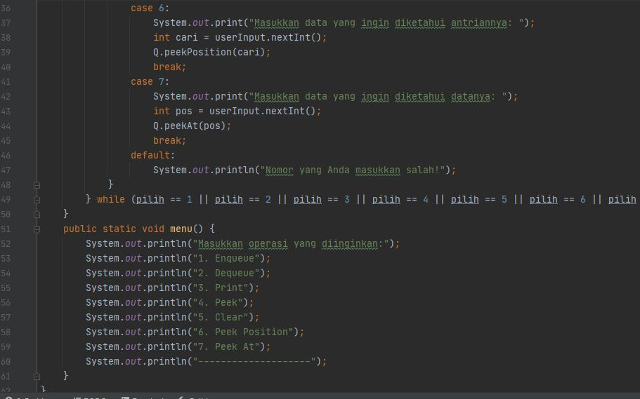

2. Pada tugas 2 terdapat soal membuat program antrian untuk mengilustrasikan mahasiswa yang sedang meminta tanda tangan KRS pada dosen DPA di kampus.. Berikut di bawah ini gambar hasil dari keluaran program yang dimana menggunakan konsep stack:

    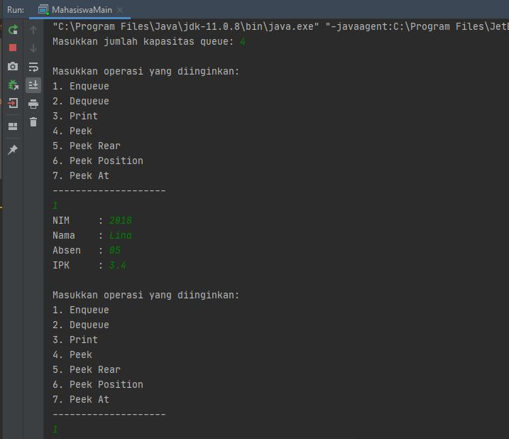

    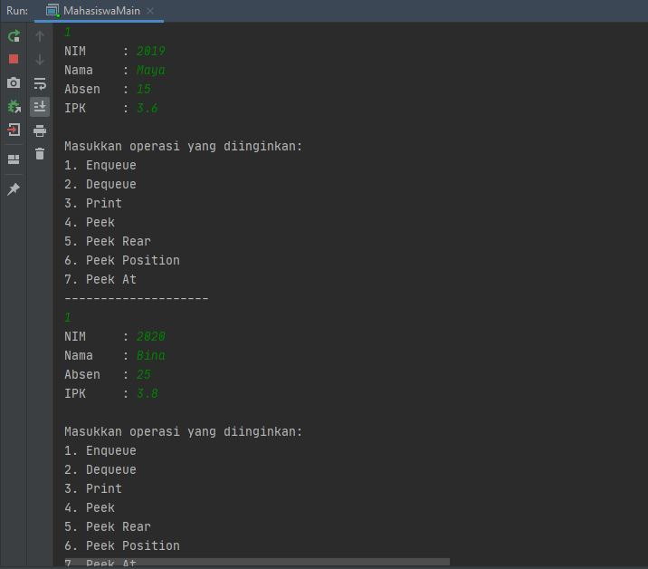

    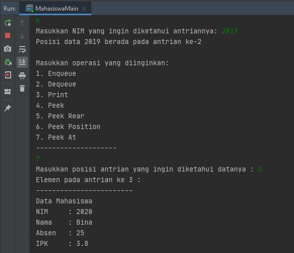

    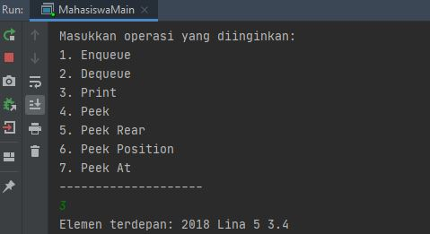

Terima kasih.
    
 *Silakan dilihat pula kode program penugasan di folder Praktikum 8
