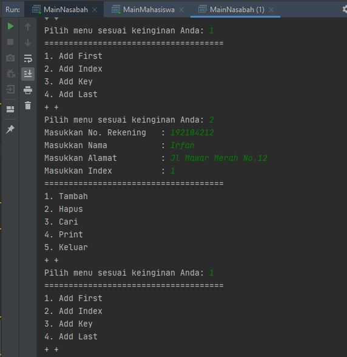

# Laporan Praktikum Pertemuan 11
Maulana Bintang Irfansyah_TI-1H
## Jawaban untuk Pertanyaan 9.2.3

1. Hasil keluaaran untuk baris pertama menghasilkan "Linked List Kosong" karena pada class SLLMain terdapat sintaks s.print(); untuk pertama kali program mengeksekusi dimana data yang ditambahkan belum dieksekusi di baris pertama melainkan dimulai di baris kedua. Sehingga hasil keluaran program di baris pertama "Linked List Kosong".

2. Pada kode program tersebut digunakan Jika data yang di temporary adalah sama dengan key mana yang ingin diarahkan, maka node setelah head akan menjadi node setelah ndInput. Kemudian untuk ndInput akan berada di node setelah temporary.

3. Kegunaan kode pada soal di method insertAt adalah jika terdapat node yang posisinya setelah dari setelahnya temp sama dengan null, maka node setelah temp bertindak sebagai tail.

## Jawaban untuk Pertanyaan 9.3.3

1. Kegunaan keyword break adalah untuk menghakhiri sebuah eksekusi statement dalam program. Dimana pada method remove keyword break memberhentikan kondisi untuk ((temp.data == key) && (temp == head)) dan juga untuk kondisi (temp.next.data == key).

2. Kegunaan kode pada soal di method remove terdapat sebuah kondisi if else dimana jika pernyataan node untuk data setelah temp sama dengan key, maka node yang posisinya setelah temp posisinya sama dengan setelah dari setelah temp akan dieksekusi.

3. Data yang dikeluarkan adalah data yang paling depan ditunjukkan pada potongan program

4. Nilai kembalian pada method indexOf terdiri dari return -1 pada kondisi jika data tmp sama dengan null yang akhirnya bernilai benar, jika salah akan return index dimana mengembalikan nilai pada index.

## Output Program Praktikum
Pada pertemuan 11 mata kuliah "Algoritma dan Struktur Data" terdapat penugasan tentang "Linked List".

1. Pada tugas 1 terdapat soal menambahkan method insertBefore untuk menambahkan node sebelum keyword yang diinginkan. Berikut di bawah ini gambar penambahan kode program dan hasil keluarannya:

    

    

2. Pada tugas 2 terdapat soal membuat program dari implementasi ilustrasi Linked List. Berikut di bawah ini gambar hasil dari keluaran program:

    

    

    

    

3. Pada tugas 3 terdapat soal membuat program dari implementasi stack menggunakan Linked List. Berikut di bawah ini gambar hasil dari keluaran program:

    

4. Pada tugas 4 terdapat soal membuat program tentang nasabah bank menggunakan Linked List. Berikut di bawah ini gambar hasil dari keluaran program:

    

    

    

    

    

5. Pada tugas 5 terdapat soal membuat program dimana mengimplementasikan queue pada antrian nasabah menggunakan konsep Linked List. Berikut di bawah ini gambar hasil dari keluaran program:

    

    

    

    

    

Terima kasih.
    
 *Silakan dilihat pula kode program penugasan di folder Praktikum 9
