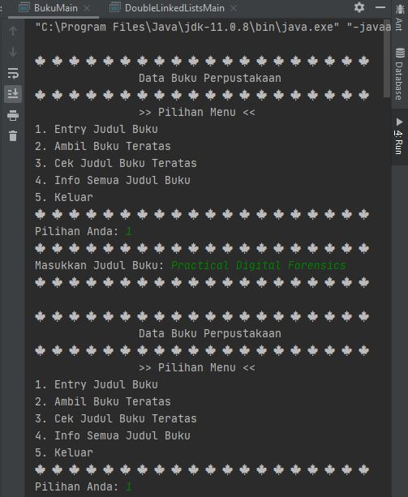
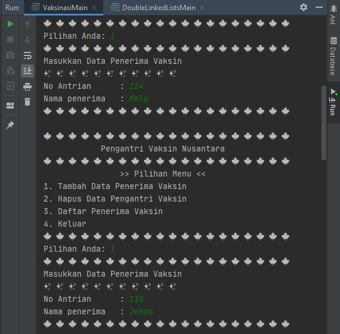
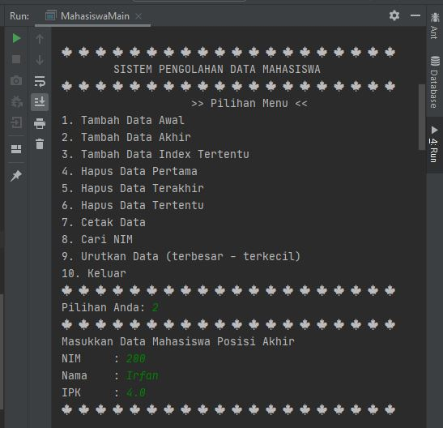

# Laporan Praktikum Pertemuan 12
Maulana Bintang Irfansyah_TI-1H
## Jawaban untuk Pertanyaan 12.2.3

1. Single linked list adalah linked list yang hanya memiliki satu variabel pointer saja. Single linked list memiliki keterhubungan satu arah, yaitu pointer next untuk menunjuk ke note setelahnya. Sedangkan double linked list adalah linked list yang memiliki dua buah pointer, yaitu next dan prev. Double linked list memiliki keterhubungan dua arah, yaitu pointer next untuk menunjuk ke node setelahnya dan pointer prev menunjuk ke node sebelumnya.

2. Atribut next berfungsi sebagai pointer untuk menunjuk pada node setelahnya. Dan atribut prev berfungsi sebagai pointer untuk menunjuk pada node sebelumnya.

3. Fungsi dari inisialisasi atribut head = null dan size = 0 adalah untuk mendeklarasikan bahwa atribut head masih kosong yang berarti linked list masih kosong atau belum terisi, dan size atau ukuran yang memuat jumlah dari node linked list adalah 0.

4. Node prev dianggap sama dengan null karena method ini adalah method yang berfungsi untuk mengisi node pertama pada linked list, yang dimana pada double linked list, node prev pada head selalu menunjuk pada null.

5. Maksud dari head.prev = newNode adalah linked list mengubah node prev dari head awal, karena data ditambahkan dengan data baru di awal linked list. Sehingga head awal akan menunjuk ke node yang baru yang juga menjadi head yang baru.

6. Pembuatan object Node dengan mengisikan parameter prev dengan current karena current merupakan node terakhir pada linked list, lalu setelah node tersebut ditambahkan dengan node baru yang node prev-nya menunjuk pada node yang terakhir tadi. Dan parameter next dengan null karena node yang baru akan ditaruh di node paling akhir, yang dimana next dari node terakhir selalu menunjuk pada null.

## Jawaban untuk Pertanyaan 12.3.3

1. Statement tersebut berarti head awal diganti dengan head.next, dan prev dari head yang baru diganti menjadi null. Statement ini dilakukan agar node pertama pada linked list dapat terhapus dan digantikan oleh node setelah node pertama, dan prev dari head menunjuk ke null.

2. Cara mendeteksi data ada pada bagian akhir yaitu dengan cara memberikan kondisi apabila node next nya menunjuk pada null, maka node tersebut adalah node terakhir, karena next pada node terakhir selalu menunjuk pada null, hal tersebut dibuktikan pada potongan kode program berikut:

    

Yang berarti perulangan akan berhenti ketika node next bernilai null.

3. Potongan kode program tersebut pada jobsheet tidak cocok untuk perintah remove disebabkan karena head.next = tmp.next dan tmp.next.prev = head. Seharusnya menggunakan kode program berikut:
 
    

4. Fungsi kode program tersebut pada method remove() yaitu current.prev.next = current.next berfungsi untuk mengubah node next pada node sebelum current diubah menjadi node current.next, sehingga node current diabaikan dan next dari node sebelum current langsung menunjuk pada node setelah current current.next.prev = current prev berfungsi untuk mengubah node prev pada node setelah current diubah menjadi node current.prev, sehingga node current diabaikan dan prev dari node setelah current langsung menunjuk pada node sebelum current.

## Jawaban untuk Pertanyaan 12.4.3

1. Kegunaan method size() yaitu untuk mengetahui ukuran atau jumlah dari seluruh node yang ada pada linked list lalu nilainya dikembalikan pada pemanggilan method tersebut dengan tipe data int.

2. Indeks pada linked list dimulai dari 0, indeks ini tergantung pada inisiasi perulangannya, apakah dimulai dari 0 atau 1, pada percobaan yang telah dilakukan, perulangannya dimulai dari 0, hal ini dapat kita ketahui melalui method add(), remove(), dan get() dengan inisialisasi i = 0.

3. Ada perbedaan antara fungsi Add pada double linked list (DLL) dan single linked list (SLL). Pada DLL dilakukan pengubahan pada 2 atribut pada node yaitu pengubahan atribut prev dan next, sedangkan pada SLL dilakukan pengubahan hanya 1 atribut yaitu atribut next saja, perbedaan dapat terlihat dari potongan kode program berikut

DLL :

 SLL: 

4. Perbedaannya memastikan linked list kosong dimana pada logika kode program (a) terdapat pemilihan jika size == 0 maka return true, dan tidak return false. Sedangkan pada logika kode program (b) memastikan linked list kosong dimana mengembalikan head == null.

## Output Program Praktikum
Pada pertemuan 12 mata kuliah "Algoritma dan Struktur Data" terdapat penugasan tentang "Double Linked List".

1. Pada tugas 1 terdapat soal membuat program menggunakan double linked lists. Berikut di bawah ini gambar penambahan kode program dan hasil keluarannya:

    

    

    

    

    

    

    

    

    

2. Pada tugas 2 terdapat soal membuat program dari implementasi stack menggunakan double linked lists tentang "Data Buku Perpustakaan. Berikut di bawah ini gambar hasil dari keluaran program:

    

    

    

    

    

    

    

3. Pada tugas 3 terdapat soal membuat program antrian vaksinasi dari menggunakan queue berbasis double linked list. Berikut di bawah ini gambar hasil dari keluaran program:

    

    

    

    

    

4. Pada tugas 4 terdapat soal membuat program tentang pengolahan data mahasiswa yang menggunakan double linked lists. Berikut di bawah ini gambar hasil dari keluaran program:

    

    

    

    

    

    

    

    

Terima kasih.
    
 *Silakan dilihat pula kode program penugasan di folder Praktikum
