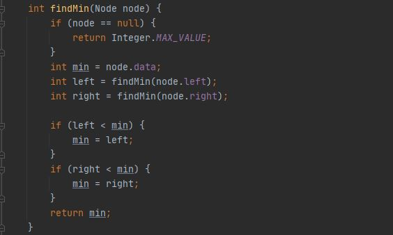

# Laporan Praktikum Pertemuan 14
Maulana Bintang Irfansyah_TI-1H
## Jawaban untuk Pertanyaan 14.2.2

1. Dalam binary search tree proses pencarian data lebih efektif dibandingkan dengan binary tree biasa karena Binary Search Tree memiliki sifat bahwa semua left-child harus lebih kecil daripada right-child dan parent-nya. Sehingga, data terurut dari data terkecil di left-child hingga data terbesar yang berada di right-child.

2. Pada class Node, fungsi atribut left adalah sebagai pointer yang menunjuk ke left-child, sedangkan fungsi dari atribut right adalah sebagai pointer yang menunjuk ke right-child.

3. 
    a) Keguanaan dari atribut root adalah sebagai node awal pada binary tree dan tidak memiliki predessor maupun parent.
    b) Ketika objek tree pertama kali dibuat, nilai dari root adalah null yang berarti kosong atau tidak ada data.

4. Ketika tree masih kosong atau bernilai null, dan akan ditambahkan sebuah node baru, maka method add akan dijalankan dan node awal yang bernilai null akan diubah dengan data baru.

5. Fungsi kode program tersebut adalah untuk melakukan pengecekan pada data baru yang ditambahkan pada method add dengan data pada current, yaitu data yang terdapat pada root. Jika data yang ditambahkan bernilai kurang dari data root, maka dilakukan pengecekan pada child sebelah kiri root (current.left). Setelah itu dilakukan pengecekan, apakaha current.left != null, yaitu apabila child kiri bernilai tidak null, maka current akan diubah menjadi current.left, dan proses ini terus berulang hingga proses masuk ke percabangan dari pengecekan current.left != null. Apabila child kiri sudah bernilai null, maka current.left akan ditambahkan data baru yang diinputkan pada parameter method add, dan program akan melakukan break atau menghentikan proses perulangan yang sedang berlangsung.

## Jawaban untuk Pertanyaan 14.3.2

1. Pada class BinaryTreeArray terdapat atribut data yang berfungsi sebagai array yang menyimpan data bertipe integer, dan atribut idxLast berfungsi untuk menyimpan data indeks terakhir data array yang merupakan leaf paling kanan binary tree dengan tipe data integer.

2. Kegunaan dari method populateData() adalah untuk mengisi atribut data dan idxLast pada class BinaryTreeArray. 

3. Kegunaan dari method traverseInOrder() adalah untuk mencetak data secara in-order, yaitu data dicetak di tengah proses ketika setelah mengunjungi left-child dan sebelum mengunjungi right-child.

4. Suatu node binary tree disimpan dalam array indeks 2, maka posisi left-child berada pada indeks: 2 * indeks + 1 = 2 * 2 + 1 = 5 dan posisi right-child berada pada indeks: 2 * indeks + 2 = 2 * 2 + 2 = 6. Jadi, posisi indeks left-child dan right-child masing-masing adalah 5 dan 6.

5. Kegunaan int idxLast = 6 adalah untuk menyimpan data indeks terakhir yaitu sampai 6. Dimana data dari int[] data = {6, 4, 8, 3, 5, 7, 9, 0, 0, 0} yang nantinya dicetak adalah {6, 4, 8, 3, 5, 7, 9} dan melewatkan data {0, 0, 0} karena kita telah me-set statement int idxLast = 6.

## Output Program Praktikum
Pada pertemuan 14 mata kuliah "Algoritma dan Struktur Data" terdapat penugasan tentang "Tree".

1. Pada tugas praktikum pertama sampai keempat terdapat perintah untuk menambahkan method-method di dalam class BinaryTree, yaitu:
    1) Method menambahkan node dengan cara rekursif
    

    2) Method menampilkan nilai paling kecil dan paling besar
    

        

    3) Method menampilkan data yang ada di leaf

    4) Method menampilkan jumlah leaf yang ada di dalam tree
    

 Berikut di bawah ini gambar hasil keluaran program:
    

2. Pada tugas kelima terdapat perinah memodifikasi class BinaryTreeArray, yaitu:
    1) Method add(int data) untuk memasukkan data ke dalam tree
    

    2) Method traversePreOrder() dan traversePostOrder()
    

 Berikut di bawah ini gambar hasil dari keluaran program:
    
    
Terima kasih.
    
 *) Silakan dilihat pula kode program penugasan di folder Praktikum
