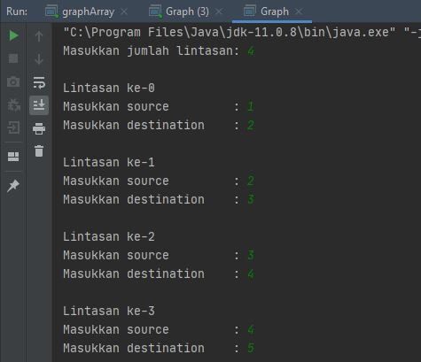

# Laporan Praktikum Pertemuan 15
Maulana Bintang Irfansyah_TI-1H
## Jawaban untuk Pertanyaan 15.2.3

1. 
📌Algoritma Brent, digunakan untuk menentukan    adanya daur dalam graph (cycle).

📌Algoritma Dijkstra, digunakan untuk menentukan lintasan terpendek pada graf berbobot.

📌Algoritma Kruskal, digunakan untuk menentukan pohon perentang terbobot minimum.

2. Tujuan pembuatan variabel LinkedList list[] adalah untuk membuat array dari tipe data class LinkedList. Dalam hal ini "list[]" digunakan untuk menyimpan vertex, edge, dan vertex yang terhubung pada edge-nya pada graph.

3. Alasan pemanggilan method addFirst() dalam method addEdge() karena ketika terdapat penambahan edge, maka node harus diberi tahu tujuan edge-nya juga, dan pada array index destination. Sehingga, node harus diberi tahu asal edge-nya juga. Jadi, antara array index source dan array index destination saling terhubung satu sama lain.

4. Dengan cara mencocokan menggunakan perulangan pada variabel i ketika i bernilai sama dengan parameter destination yang di-input-kan, maka edge akan dihapus.

5. Tidak terjadi kesalahan, dan edge ke-3 dari vertex ke-1 dapat terhapus.
    
    

## Jawaban untuk Pertanyaan 15.3.3

1. 
📌 Pada directed graph, degree hanya dihitung sesuai jumlah masing-masing "inDegree" dan "outDegree", lalu semuanya dijumlahkan.

📌Sedangkan pada undirected graph, degree hanya dihitung dari berapa banyak edge yang terhubung pada vertex tersebut.

2. Alasan jumlah vertices harus ditambahkan dengan 1 pada indeks array di gambar soal karena untuk memudahkan pembacaan pencetakan matriks yang membentuk representasi graph. Sebenarnya bisa saja dimulai dari 0, tetapi semua perulangan harus dimulai dari 0.

3. Method "getEdge" digunakan untuk memeriksa apakah ada vertex yang terhubung antara vertex <to\> dan vertex <from\> jika tidak ada data yang terhubung, maka vertex tidak ada.

4. Jenis directed graph.

5. Karena "try-catch Exception" digunakan untuk mendeteksi kesalahan yang terjadi ketika menjalankan method-method yang ada.

## Output Program Praktikum
Pada pertemuan 15 mata kuliah "Algoritma dan Struktur Data" terdapat penugasan tentang "Graph".

1. Pada tugas praktikum pertama terdapat perintah untuk mengubah lintasan pada praktikum 12.2 menjadi inputan. Berikut ini gambar kode program dan hasil keluarannya:
 
    

    

    

2. Pada tugas kedua terdapat perintah menambahkan method "graphType" dengan tipe boolean yang membedakan graph termasuk directed atau undirected graph. Berikut ini gambar kode program dan hasil keluarannya:

    

    

    

 3. Pada tugas ketiga terdapat perintah memodifikasi method "removeEdge" agar tidak menghasilkan output yang salah untuk path selain path pertama kali. Berikut ini gambar kode program dan hasil keluarannya:

    

    

    

    

    

    

4. Pada tugas keempat terdapat perintah mengubah tipe data vertex pada seluruh graph. Berikut ini gambar kode program dan hasil keluarannya:

    

    

    

Terima kasih.
    
 *) Silakan dilihat pula kode program penugasan di folder Praktikum
