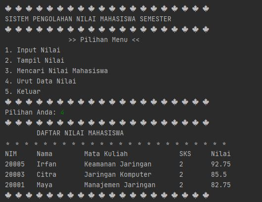

# Laporan Praktikum Pertemuan 16
Maulana Bintang Irfansyah_TI-1H
## Jawaban untuk Pertanyaan 16.2.3

1. Karena "ArrayList" merupakan collection dari Java yang dapat menambah data baru secara dinamis tanpa harus menentukan ukurannya di awal. Sehingga, operasi yang dapat dilakukan dengan "ArrayList" terdiri dari: size(), add(), get(), remove(), isEmpty(), indexOf(), contains(), dan set().

2. Gambar di bawah ini adalah hasil modifikasi baris kode 25-36, sehingga data yang ditampung hanya satu jenis saja, yaitu "String".

    

3, 4, dan 5. Setelah menambahkan kode program seperti gambar di bawah ini, hasil keluarannya sama saja dengan menggunakan perintah names.add("Noureen") yaitu menambahkan data, di gambar ini menggunakan perintah names.push("Mei-mei"). Sehingga, dapat disimpulkan dengan adanya perintah "names.push()" dapat menambahkan data pada posisi nilai top (atas).

 

 

## Jawaban untuk Pertanyaan 16.3.3

1. Antara method push() dan add() sama-sama menambahkan elemen pada stack, dan jika menggunakan keduanya tidak akan mengalami masalah apa pun. Perbedaannya adalah method push() yaitu method dari Stack yang merupakan subclass dari Vector yang menggunakan standar last-in first-out (LIFO), sedangkan add() yaitu method dari ArrayList.

2. Setelah menghapus sintaks pada baris ke-43 dan 44 yang terjadi hasil keluarannya seperti gambar di bawah ini, yaitu hanya menampilkan "Banana, Orange, Watermelon, Leci, Salak":

    

3. Fungsi dari baris 46-49 adalah untuk menampilkan elemen "Melon" dan "Durian" dengan menggunakan iterator, for-each, dan perulangan biasa. Hasil akhirnya sama-sama menampilkan "Melon" dan "Durian". Sehingga, tergantung dari si pembuat program untuk memilih ketiga jenis metode perulangan tersebut.

4. Hasil yang terjadi adalah program tidak dapat dijalankan karena List<>String tidak dapat dijanlankan bersamaan Stack jika tidak ada collection List-nya, sehingga perlu menambahkan collection List agar program dapat dijalankan.

5.
    

6. 
    

## Jawaban untuk Pertanyaan 16.4.3

1. Pada method tambah() menggunakan unlimited argument yang memiliki konsep "Variable-Length Argument List" atau yang disebut juga dengan "varargs". Parameter varargs ini dapat berupa tipe primitif ataupun objek.
Kelebihan penggunaan "varargs" pada method tambah(Mahasiswa...) adalah menambahkan data sebagai parameternya bisa jadi lebih dari satu.

2 dan 3:

   

## Output Program Praktikum
Pada pertemuan 16 mata kuliah "Algoritma dan Struktur Data" terdapat penugasan tentang "Java Collection".

1. Pada tugas praktikum pertama terdapat perintah untuk membuat program perpustakaan. Berikut ini gambar kode program dan hasil keluarannya:
 
    

    
    
    

    

    

    

    

2. Pada tugas kedua terdapat perintah membuat program daftar nilai mahasiswa semester. Berikut ini gambar kode program dan hasil keluarannya:

    

    

    

    

    

    

Terima kasih.
    
 *) Silakan dilihat pula kode program penugasan di folder Praktikum
