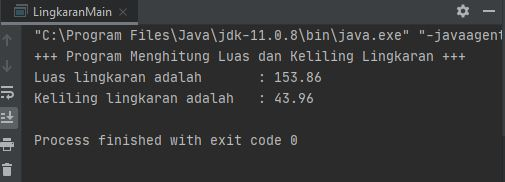
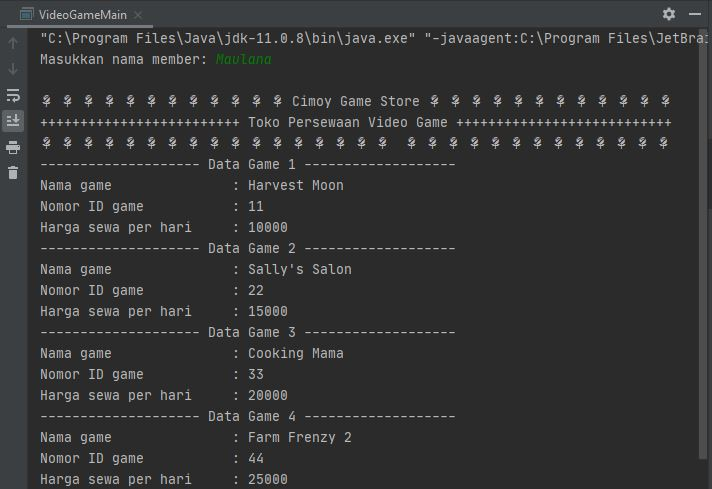
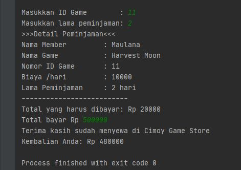
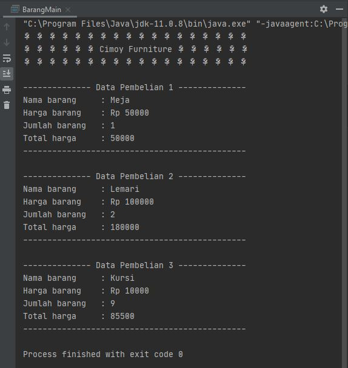
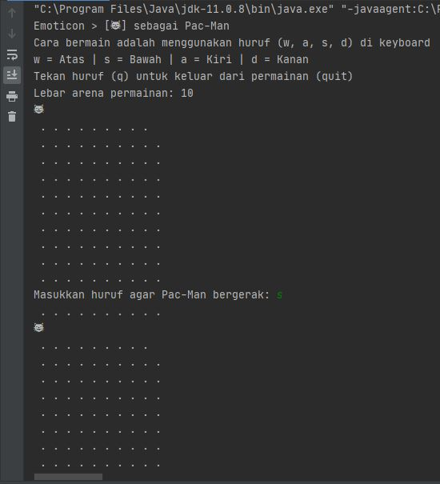

# Laporan Praktikum Pertemuan 2
Maulana Bintang Irfansyah_TI-1H
## Jawaban 2.2.3 Pertanyaan
1. Memiliki sesuatu (atribut) dan Dapat melakukan sesuatu tingkah (method).
2. Class.
3. Terdapat 4 atribut yang terdiri dari: String namaBarang, jenisBarang(Baris ke-13), int stok, dan hargaSatuan(Baris ke-14).
4. Terdapat 4 method yaitu:
    a) tampilBarang(), untuk menampilkan data-data barang.
    b) tambahStok(), untuk menambah stok barang
    c) kurangiStok(), untuk mengurangi stok barang
    d) hitungHargaTotal(int jumlah), untuk menghitung total dari jumlah pembelian barang.
5. Karena method tambahStok() untuk menambah jumlah stok yang ada menggunakan bilangan bulat n dimana bilangan bulat tersebut memiliki tipe data int.
6. Karena digunakan untuk perhitungan aritmatika.
7. Karena method tambahStok() tidak mengembalikan nilai.

## Output Program Tugas 1-4
Pada pertemuan 2 mata kuliah "Algoritma dan Struktur Data" terdapat penugasan tentang "Object" di materi Pemrograman Berorientasi Objek.

1. Pada tugas 1 terdapat soal untuk membuat program tentang menghitung luas dan keliling lingkaran. Pada program ini saya menambahkan sintaks 'this' di construktor Lingkaran dimana fungsinya untuk mereferensikan objek yang sedang digunakan. Sintaks tersebut saya tambahkan pula di program-program berikutnya. Berikut di bawah ini gambar hasil dari keluaran programnya, yaitu luas = 153.86 dan keliling = 43.96

    

2. Pada tugas 2 terdapat soal untuk membuat program tentang penyewaan video game. Dimana saya menampilkan jenis-jenis video game yang dapat dipinjam. Sehingga pelanggan dapat memilih game yang ingin dipinjam. Kemudian di program ini saya menampilkan pula data pinjaman dan harga bayar. Berikut di bawah ini gambar hasil dari keluaran program.

    
    

3. Pada tugas 3 terdapat soal untuk membuat program tentang perhitungan pembelian barang. Di program ini saya menambahkan 3 jenis barang yang ditampilkan beserta harganya dan jumlahnya. Kemudian program dapat menghitung harga total di akhir. Berikut di bawah ini gambar hasil dari keluaran program.

    

4. Pada tugas 4 terdapat soal untuk membuat program tentang membuat game Pac-Man. Dimana saya membuat method untuk bergerak ke arah atas, bawah, kanan, dan kiri. Di program ini saya tambahkan pula method untuk menampilkan arena permainan Pac-Man agar game sederhana ini dapat berjalan dengan baik. Berikut di bawah ini gambar hasil dari keluaran program.
    

    Terima kasih.
    
    *Silakan dilihat pula kode program penugasan di folder Struktur Data
