# Laporan Praktikum Pertemuan 3
Maulana Bintang Irfansyah_TI-1H
## Jawaban untuk Pertanyaan 3.2.3
1. Class yang dibuat objek harus memiliki atribut dan method sekaligus karena class array objek tersebut memiliki sebuah objek yaitu persegi panjang yang akan diproses nantinya.

2. Konstruktor adalah method yang memiliki nama sama persis dengan nama classnya dan tidak memiliki tipe pengembalian nilai (return). Konstruktor akan dipanggil pertama kali saat membuat objek dari class tersebut. Pada praktikum ini konstruktor digunakan untuk mengisi nilai-nilai attribut pada class objek.

3. Maksud kode tersebut adalah membuat Array objek bernama ppArray di class PersegiPanjang dengan panjang array sebanyak 3.

4.Maksud kode tersebut adalah menginisialisasi pembuatan serta pengisian atribut dalam array ppArray.

5. Class main dan class PersegiPanjang dipisah karena agar konsep dari class yang sudah ditentukan menjadi jelas dan tidak rancu saat pembuatan program.

## Jawaban untuk Pertanyaan 3.3.3
1. Array of object bisa diimplementasikan pula di array 2 dimensi.

2. Contoh array 2 dimensi dapat diterapkan dalam pembuatan program data siswa yang teridri dari baris dan kolom. Baris untuk nama dan kolom untuk nilainya.

3. Yang kurang adalah instance object-nya yaitu Persegi[] pgArray = new Persegi();

4.
      
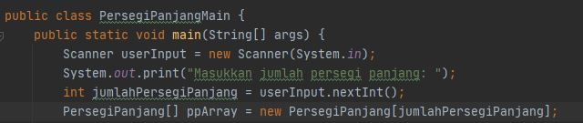

5. Tidak apa-apa diperbolehkan karena ppArray[0] dan di bawahnya terdapat ppArray[i], maka akan ter-update nilainya pada ppArray[0].

## Jawaban untuk Pertanyaan 3.4.3
1. Iya, konstruktor dapat lebih dari satu di kelas. Juga konstruktor dapat diisikan dengan parameter ataupun tidak.

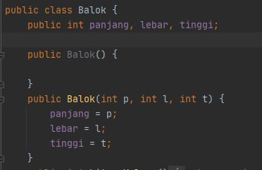

2. 

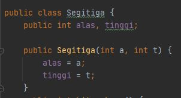

3. 
   
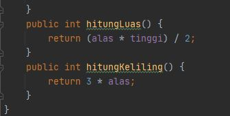

4. 
  
 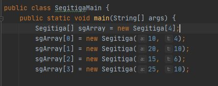

## Output Program Tugas 1-5
Pada pertemuan 3 mata kuliah "Algoritma dan Struktur Data" terdapat penugasan tentang "Array of Object".

1. Pada tugas 1 terdapat soal untuk membuat program tentang menghitung luas dan volume bangun ruang. Di program ini saya membuatkan program perhitungan untuk bangun ruang kubus, kerucut, tabung, dan balok.Berikut di bawah ini gambar hasil dari keluaran programnya:

    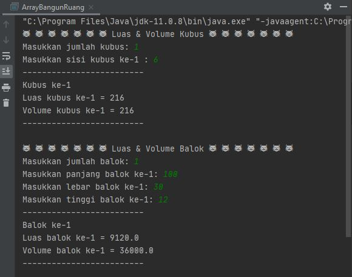
    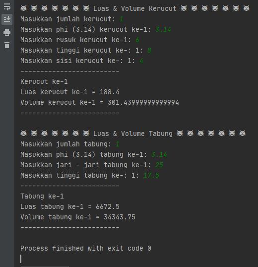

2. Pada tugas 2 terdapat soal untuk membuat program tentang perhitungan luas tanah. Dimana atribut panjang dan lebar tanah di-input-kan oleh user. Berikut di bawah ini gambar hasil dari keluaran program:

    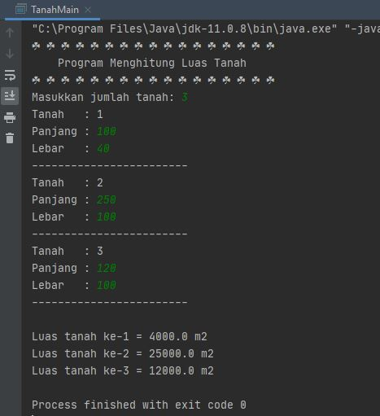

3. Pada tugas 3 soal programnya sama dengan soal ke-2. Akan tetapi, terdapat modifikasi untuk pencarian tanah terluas. Berikut di bawah ini gambar hasil dari keluaran program:

    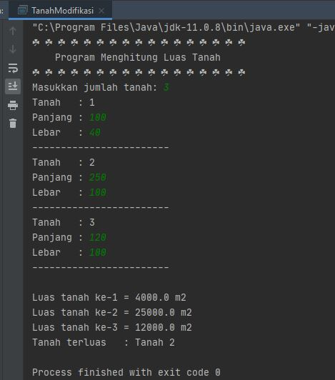

4. Pada tugas 4 terdapat soal untuk membuat program tentang menampilkan informasi mahasiswa yang berasal dari hasil inputan user. Berikut di bawah ini gambar hasil dari keluaran program:
    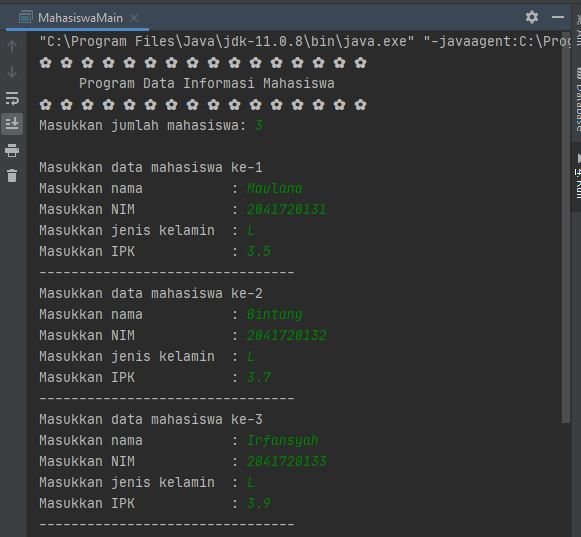

    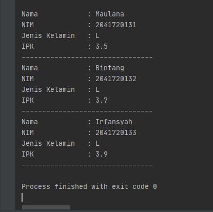

5. Pada tugas 5 soal programnya sama dengan soal ke-4. Akan tetapi, terdapat modifikasi untuk perhitungan IPK rata-rata seluruh mahasiswa yang di-input-kan user. Berikut di bawah ini gambar hasil dari keluaran program:

    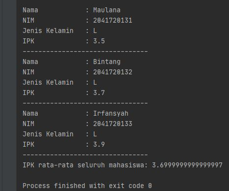

Terima kasih.
    
 *Silakan dilihat pula kode program penugasan di folder Praktikum 3
