# Laporan Praktikum Pertemuan 5
Maulana Bintang Irfansyah_TI-1H
## Jawaban untuk Pertanyaan 4.2.3
Sebuah algoritma divide and conquer memiliki 3 tahapan umum yakni:

🌷Divide, membagi/memecah persoalan secara terus menerus ke dalam bentuk yang lebih kecil.

🌷Conquer, memecahkan persoalan yang sudah diperkecil hingga mencapai ukuran dimana ia dapat dapat dipecahkan sendiri (base scenario)

🌷Combine, menggabungkan pemecahan/solusi dari seluruh persoalan kecil hingga menjadi solusi untuk persoalan awal.

1.
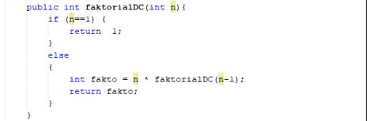
 
 Algoritma divide and conquer pada gambar di atas untuk mencari nilai faktorial dari suatu bilangan didapatkan di sini kapan algoritma berhenti melakukan rekursif, yaitu n == 1. Informasi lain yang dimiliki adalah berkurangnya jumlah data pada setiap pemanggilan faktorial. Dimana dapat diketahui fungsi matematika dari faktorialnya seperti gambar di bawah ini:

 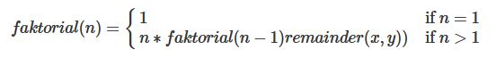

 Maka dapat disimpulkan bahwa fungsi faktorial memiliki kompleksitas n- 1 atau O(n).

2. Pada gambar kode program algoritma divide and conquer (DNC) di atas sudah terpenuhi 3 tahapan umumnya dari DNC, yaitu:

    🌷Divide, fakto = n x (n-1), artinya bahwa fakto dapat dipecahkan bila kita mengetahui nilai (n-1), dan seterusnya hingga bentuk terkecil yang bisa dipecahkan langsung yakni 1.

    🌷Conquer, jika persoalan sudah mencapai 1, kita sudah mencapai base scenario, dan nilainya dapat langsung kita berikan yakni 1!=1.

    🌷Combine, menggabungkan seluruh hasil pada tahap conquer dari 1 hingga n.

3. Iya, memungkinkan perulangan pada method faktorialBF() dirubah selain menggunakan for loop dengan while loop seperti gambar di bawah ini:

    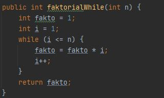
    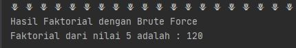

4. Penambahan sintaks untuk pengecekan waktu eksekusi pada program faktorial dengan memberikan sintaks seperti gambar di bawah ini:

    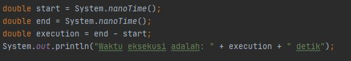

5. Adanya perbedaan waktu eksekusi dengan meng-input-kan 20 elemen dengan 3 elemen yang akan dilakukan perhitungan faktorial. Gambar di bawah ini menunjukkan keluaran hasilnya:
    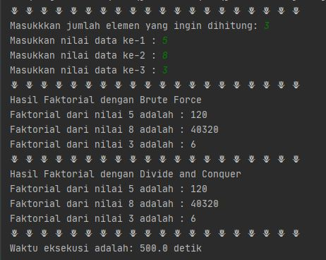 

    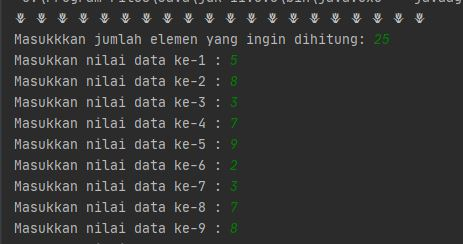

    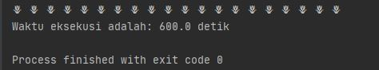

## Jawaban untuk Pertanyaan 4.3.3
1. Untuk mendapatkan hasil dari perpangkatan a^n dengan a himpunan bilangan real, dan n adalah bilangan bulat tidak negatif. Kita bisa memakai 2 algoritma Brute Force dan Divide & Conquer. Dimana untuk algoritma brute force merupakan algoritma yang paling sederhana untuk mendapatkan hasil dari a^n tinggal mengkalikan 1 dengan a sebanyak n kali. Dengan kompleksitas O(n). Sedangkan algoritma Divide & Conquer untuk kasus faktorial dapat diselesaikan dengan cara rekursif. Dengan kompleksitas O(log n).

2. Ide dasar perpangkatan menggunakan divide & conquer adalah membagi dua pangkat n menjadi n = n / 2 + n / 2 sehingga a^n = a^(n/2 + n/2) = a^n/2 . n/2. Untuk kasus n > 0, dibedakan menjadi dua kasus, yaitu:

🌷jika n genap, maka a^n = a^n/2.a^n/2

🌷jika n genap, maka a^n = a^n/2.a^n/2.a

3. 
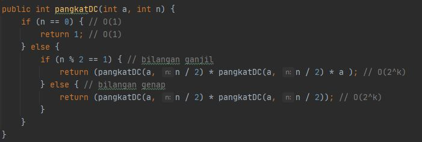

4.
  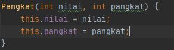

5. Modifikasi program perpangkatan dengan menambahkan pilihan brute force atau divide and conquer:
    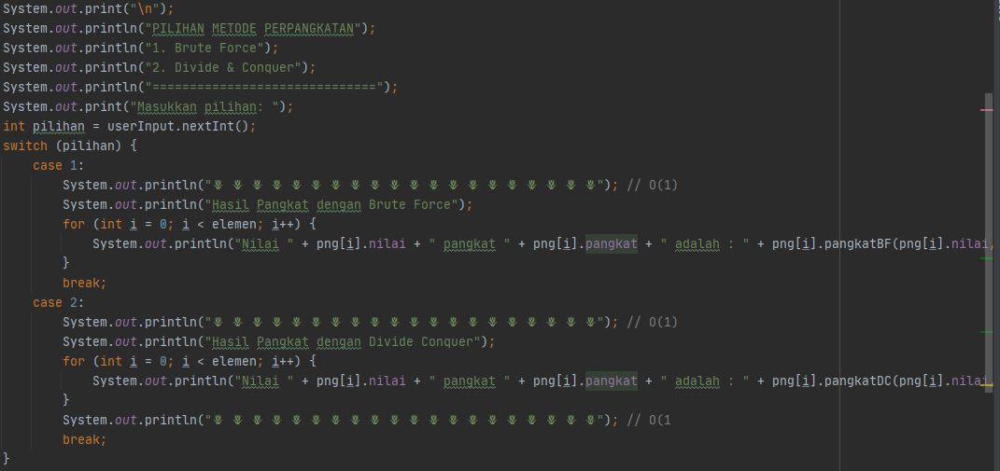

    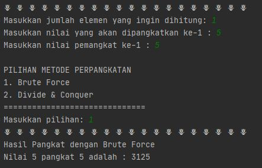

## Jawaban untuk Pertanyaan 4.4.3
1. Perbedaan perhitungan totalBF dan totalDC adalah:

🌷totalBF menggunakan fungsi iteratif dengan struktur repetisi for, pengulangan berhenti saat kondisi bernilai FALSE, dan pengulangan tanpa henti jika kondisi pengulangan selalu benar.

🌷totalDC menggunakan rekursif dengan pengulangan struktur seleksi (IF-ELSE) dan pemanggilan fungsi dirinya sendiri, pengulangan berhenti saat base case terpenuhi, dan pengulangan tanpa henti jika base case tidak terpenuhi.

2. Hasil keluaran dari kedua jenis algoritma BF dan DNC pada program perhitungan keuntugan dapat dibatasi keluarannya di belakang koma hanya dua angka menjadi standar kedua jenis algoritma dengan cara menambahkan perintah System.out.printf("%.2f", keuntungan); 

3. Terdapat formulasi return value karena untuk mengakhiri eksekusi dari fungsi tersebut, dan return juga mengembalikan nilai pada pemanggil. 

4. Variabel mid diperlukan untuk mendapatkan hasil dari parameter yang telah diberikan dan nantinya dibagi 2.

5. 
 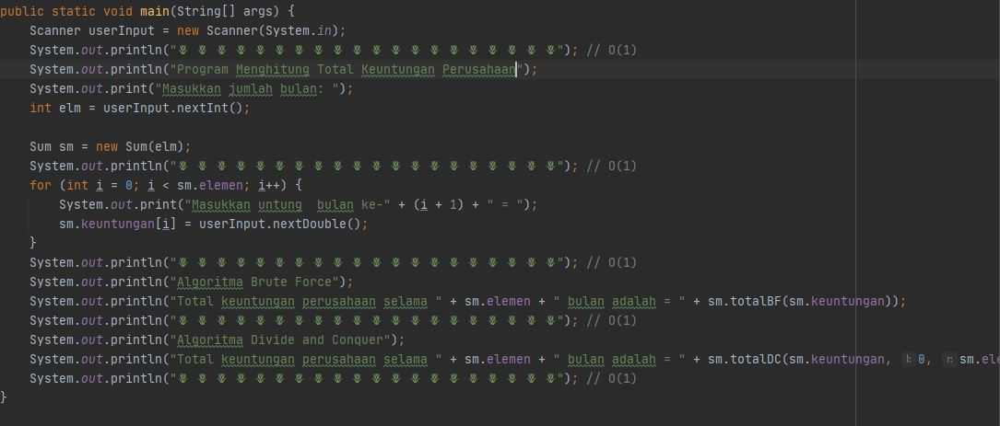

## Output Program Praktikum
Pada pertemuan 4 mata kuliah "Algoritma dan Struktur Data" terdapat penugasan tentang "Brute Force and Divide & Conquer".

1. Pada tugas 1-3 terdapat soal untuk membuat program tentang menghitung nilai-nilai mahasiswa dan total akhir nilainya. Di program ini saya membuatkan program perhitungan untuk nilai tugas, kuis, UTS, dan UAS. Kemudian, menambahkan nilai total akhirnya. Berikut di bawah ini gambar hasil dari keluaran programnya:

    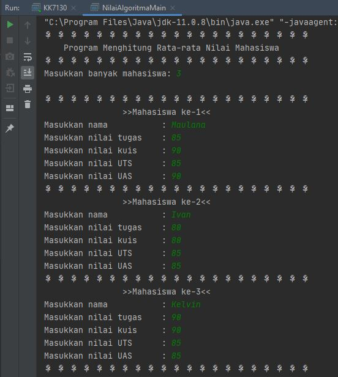
    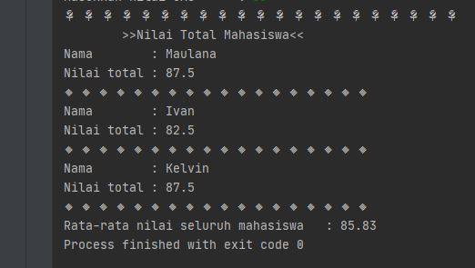

2. Pada tugas 4 terdapat soal untuk membuat program tentang pemilihan ketua BEM di Polinema dengan menentukan mayoritas jumlah suara terbanyak. Berikut di bawah ini gambar hasil dari keluaran program yang telah saya buat beserta diagram class-nya:

    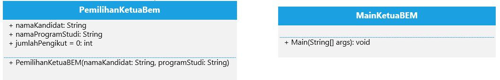

    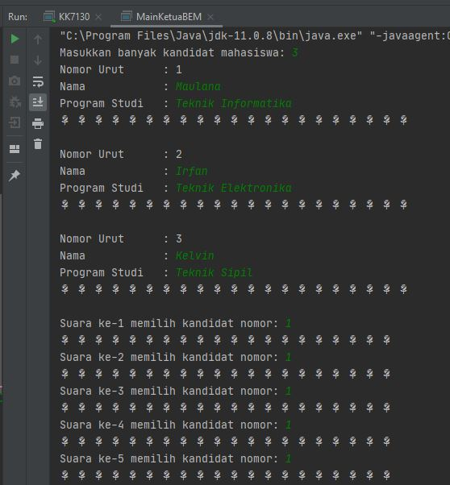

    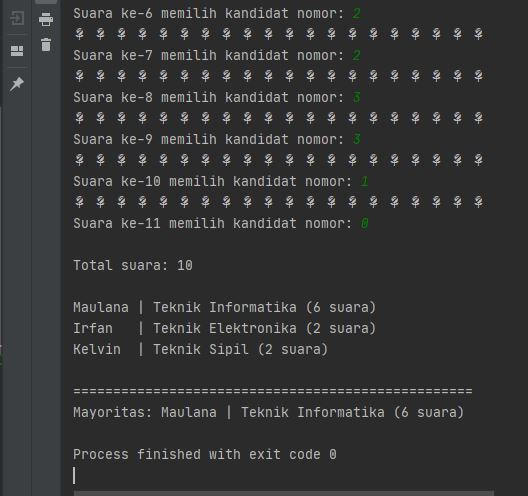

Terima kasih.
    
 *Silakan dilihat pula kode program penugasan di folder Praktikum 4
