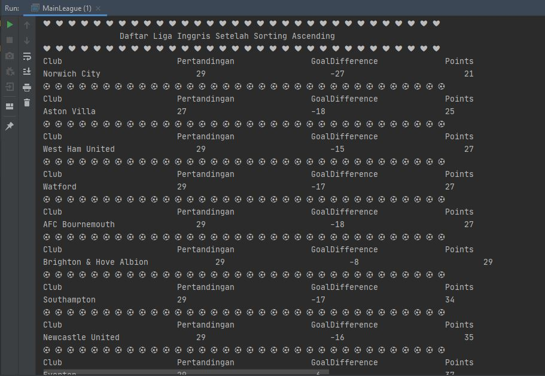

# Laporan Praktikum Pertemuan 5
Maulana Bintang Irfansyah_TI-1H
## Jawaban untuk Pertanyaan 5.2.3

1. Proses bubble sort terdapat di method void bubbleSort() yang berada di dalam class 'DaftarMahasiswaBerprestasi'.

2. Proses selection sort tidak ada di method manapun karena yang dibahas pertama kali adalah proses bubble sort.

3. Proses swap adalah proses penukaran dua nilai elemen array dari suatu indeks ke indeks yang lain pada satu array. Potongan program swap:

    

4. Baris program method bubbleSort():

    

    Proses ini merupakan proses utama algoritma bubble sort yaitu dengan membandingkan suatu indeks dengan indeks sebelumnya. Jika kondisi yang diberikan memenuhi, maka akan dilakukan proses swap atau penukaran. Misalnya ingin mengurutkan secara descending maka kondisi yang diberikan adalah jika listMhs[j].ipk > listMhs[j-1].ipk maka akan terjadi swap yaitu penukaran nilai elemen listMhs[j].ipk dengan nilai elemen listMhs[j-1].ipk 

5. Perulangan pada method bubbleSort():

     

    (A) Perulangan i (outer) digunakan untuk memulai  perulangan j (inner), sedangkan Perulangan j (inner) untuk melakukan penukaran indeks.

    (B) Karena perulangan i adalah i < listMhs.length-1 memenuhi 2 proses perulangan namun dari index 0. 

    (C) Karena perulangan j adalah j < listMhs.length-i untuk memenuhi 2 proses perulangan namun mulai dari index 1. 

    (D) Perulangan i akan berlangsung sebanyak 49 kali. Banyak tahap bubbleSort ada 1225. 

## Jawaban untuk Pertanyaan 5.3.3
1. Kode program pada method selectionSort();
    

    Maksud dari proses tersebut untuk mencari nilai terkecil lalu dilakukan penukaran tempat. Selection sort merupakan metode pengurutan dengan mencari nilai data terkecil dimulai dari data indeks ke-0 hingga indeks N-1. Jika terdapat N data dan data terkoleksi dari urutan 0 sampai dengan N-1. Selama proses, perbandingan dan pengubahan, hanya dilakukan pada indeks pembandingnya saja, pertukaran data secara fisik terjadi pada akhir proses. 

## Jawaban untuk Pertanyaan 5.4.3
1. Modifikasi ada pada folder praktikum 5, class DaftarMahasiswaBerprestasi.java method insertionSort().

    

## Output Program Praktikum
Pada pertemuan 5 mata kuliah "Algoritma dan Struktur Data" terdapat penugasan tentang "Bubble sort, Selection sort, dan Insertion sort".

1. Pada tugas 1 terdapat soal membuatkan program untuk menampilkan daftar tiket pesawat berdasarkan filter yang diinginkan oleh user. Berikut di bawah ini gambar hasil dari keluaran programnya:

    

    

    

    

    

2. Pada tugas 2 terdapat soal untuk membuat program tentang pengurutan Liga Inggris 2020. Berikut di bawah ini gambar hasil dari keluaran program:
    

    

    

    

    

Terima kasih.
    
 *Silakan dilihat pula kode program penugasan di folder Praktikum 5
