# Laporan Praktikum Pertemuan 7
Maulana Bintang Irfansyah_TI-1H
## Jawaban untuk Pertanyaan 6.2.3

1. Pada method tampilData digunakan untuk menampilkan data yang sudah dicari. Sedangkan tampilPosisi berfungsi untuk memberitahukan bahwa data yang dicari dapat ditemukan di indeks ke berapa, tapi jika datanya tidak ketemu maka ditampilkan 'data tidak ditemukan'.

2. Fungsi break pada kode program di bawah ini adalah
untuk menghentikan perulangan yang sedang berlangsung jika nilai yang dicari cocok dengan data yang ada di NIM (kondisi bernilai TRUE). Sehingga program akan melanjutkan pada tahap selanjutnya setelah perulagannya.

    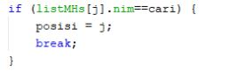

3. Program akan tetap berjalan, dan hasil keluarannya adalah benar. Karena data tidak perlu untuk diurutkan agar berjalan, sehingga program dengan sendirinya akan mencari data yang dicari meskipun data-datanya tidak terurut.

## Jawaban untuk Pertanyaan 6.3.3
Kode program 

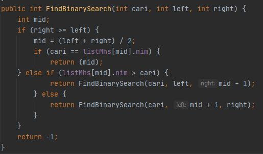

1. Proses divide dilakukan pada baris
    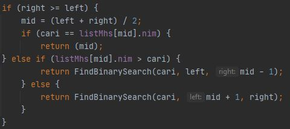   

Pada baris ini dilakukan pembagian data ke dalam 3 bagian, yaitu data kiri, tengah, dan kanan. Pencocokan dilakukan tergantung pada kondisi antara data yang dicari dengan data yang diperiksa apakah sama dengan, kurang dati ataupun lebih besar.

2. Proses conquer dilakukan pada baris
    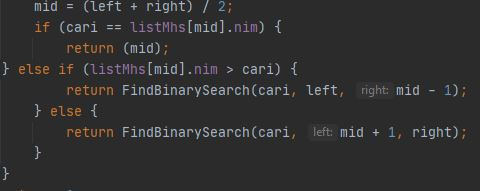   

Pada baris ini juga dilakukan pengembalian hasil dari pencocokan data, apabila data telah dittemukan, maka indeks yang didapat akan dikembalikan pada pemanggilan fungsi, dan data yang telah dipecah-pecah digabungkan kembali menjasi data yang utuh.
   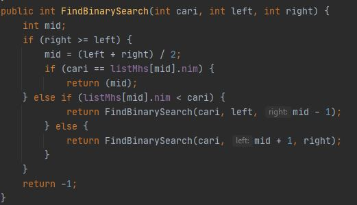 

3. Program akan tetap berjalan, tetapi data NIM yang dicari tidak dapat ditemukan. Karena Binary Search merupakan algoritma sorting yang telebih dahulu harus diurutkan data yang di dalam array-nya.

4. Hasil dari binary search adalah data tidak ditemukan, ini tidak sesuai dengan keluaran yang diharapkan. Sehingga cara agar sesau adalah mengubah kode program pada method FindBinarySearch() dengan mengubah operator logika lebih dari (>) menjadi kurang dari (<) hal ini disebabkan karena data yang ingin dilakukan pencarian sudah diurutkan dari data yang terbesar ke terkecil.
    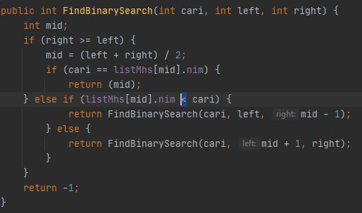

    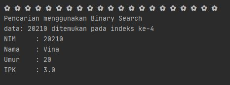 

5. Kode program
     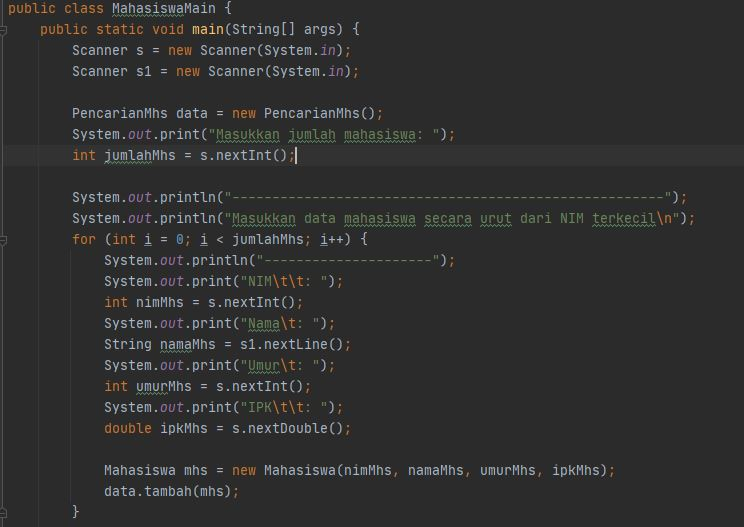 

## Output Program Praktikum
Pada pertemuan 5 mata kuliah "Algoritma dan Struktur Data" terdapat penugasan tentang "Bubble sort, Selection sort, dan Insertion sort".

1. Pada tugas 1 terdapat soal untuk memodifikasi percobaan searching dengan menggunakan Binary search. Berikut di bawah ini gambar hasil dari keluaran programnya dimana terdapat sintaks Selection sort di dalamnya:

    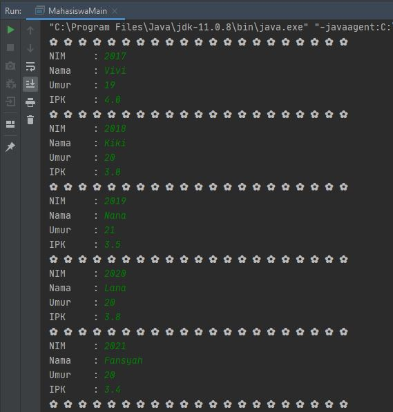

    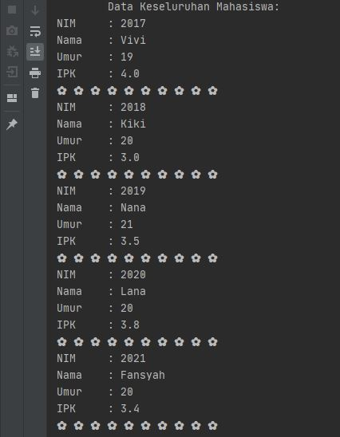

    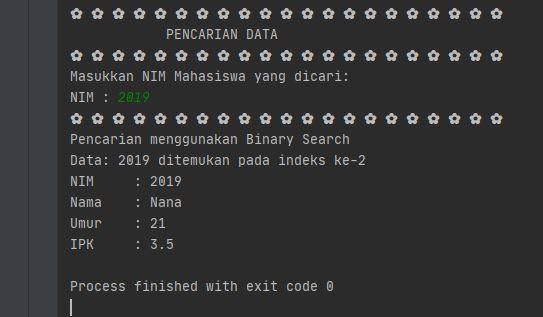

2. Pada tugas 2 terdapat soal untuk memodifikasi kembali percobaan searching dengan ketentuan pencariannya berdasarkan nama mahasiswa. Berikut di bawah ini gambar hasil dari keluaran program yang dimana menggunakan algoritma Sequential search:

    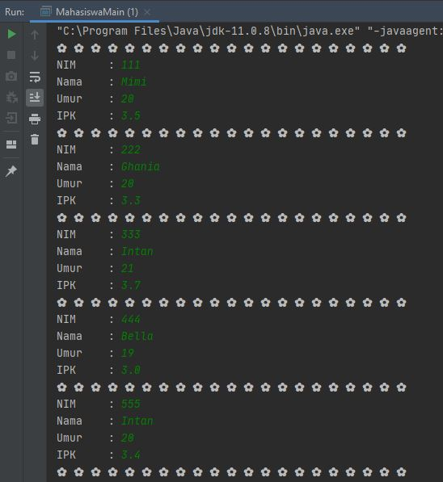

    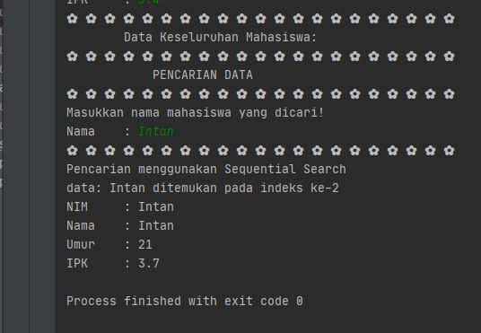

Pada indeks ke-3 dan ke-5 terdapat nama mahasiswa yang sama, maka pada saat pencarian nama 'Intan' keluaran program akan menampilkan data mahasiswa 'Intan' yang terdapat di indeks ke-3.

3. Pada tugas 3 terdapat soal untuk mencari data pada array 2 dimensi yang telah diketahui nilai datanya. Berikut di bawah ini gambar hasil dari keluaran program yang dimana menggunakan algoritma Sequential search:

    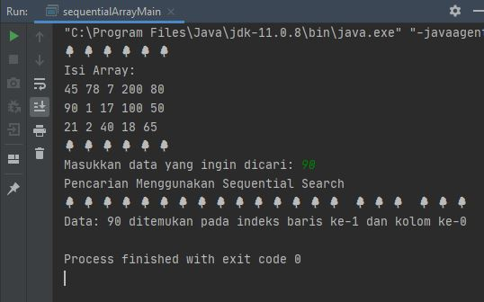

4. Pada tugas 4 terdapat soal untuk meengurutkan data pada array 1 dimensi yang telah diketahui nilai datanya, dan juga mencari dan mencetak isi array yang nilainya besar. Di sini saya menggunakan metode pengurutan Merge Sort dan mencari nilai terbesar dengan metode Binary Search. Berikut di bawah ini gambar hasil dari keluaran programnya:

    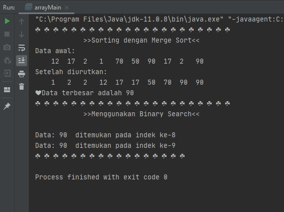

Terima kasih.
    
 *Silakan dilihat pula kode program penugasan di folder Praktikum 5
