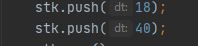
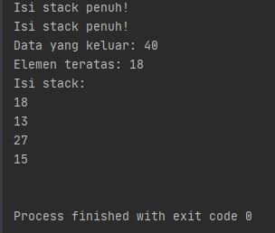
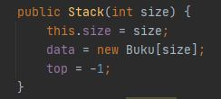
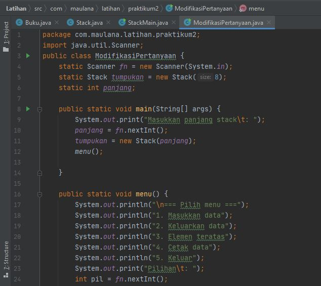
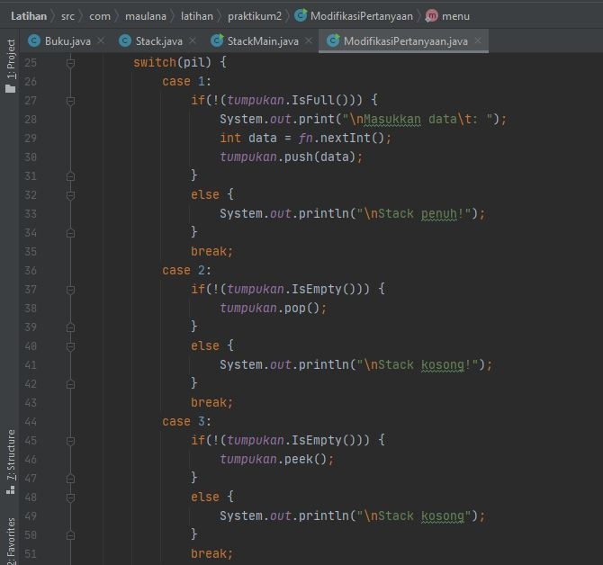
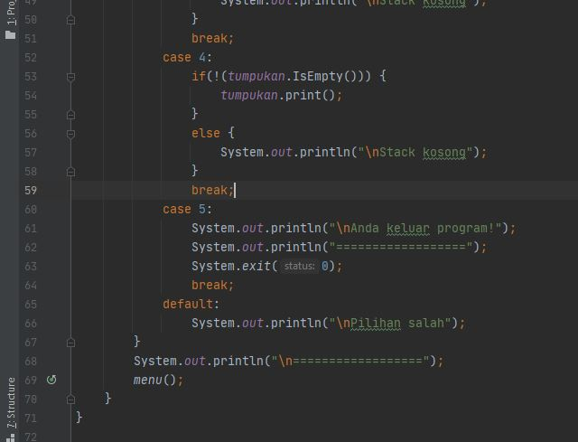
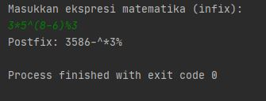
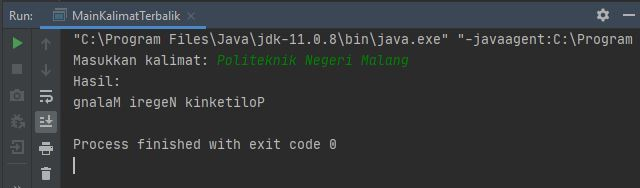
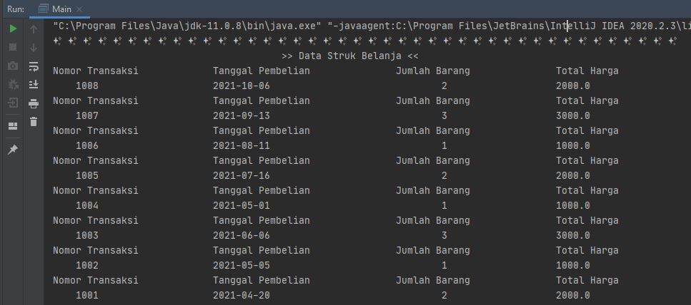
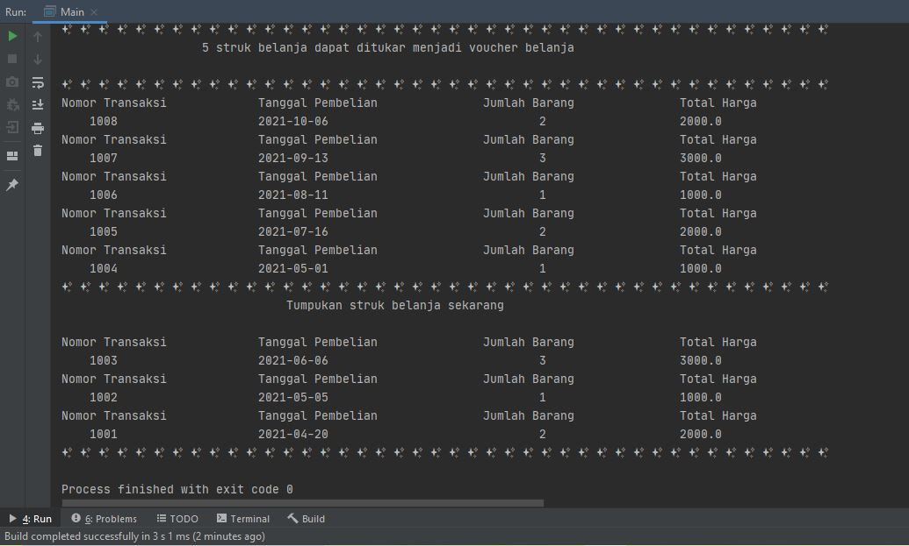

# Laporan Praktikum Pertemuan 8
Maulana Bintang Irfansyah_TI-1H
## Jawaban untuk Pertanyaan 7.2.3

1. Fungsi dari angka 5 untuk menentukan ukuran dari stack yang akan dibuat. Angka 5 berarti ukuran stack adalah 5, dan fungsi ini merujuk constructor pada class Stack.

2. 

3. Karena pada tahap pertama stack telah terisi penuh dengan 5 elemen, lalu stack di-pop agar mengeluarkan elemen teratas, sehingga isi stack saat ini terisi 4 elemen dan 1 kosong, 18 dapat menempati kekosongan tersebut. Sedangkan 40 tidak bisa karena isi stack sudah penuh, dan output menampilkan isi stack sudah penuh!

## Jawaban untuk Pertanyaan 7.3.3

1. Data yang tersimpan pada variabel bk --> st.push(bk) adalah variabel untuk menyimpan data buku-buku yang telah dimasukkan atau di-input-kan oleh si pengguna.

2. Kode program penampungan kapasitas penampungan stack:

       

3. Fungsi do-while pada class StackMain adalah membuat pertanyaan perulangan yang nantinya akan diberi pertanyaan untuk pengguna apakah ingin mengulangi untuk menambahkan data baru atau tidak.

4. Modifikasi Program
    

     

     

## Jawaban untuk Pertanyaan 7.4.3

1. Pada mata kuliah teori Algoritma dan Struktur data, pada materi Stack ada penjelasan mengenai derajat operator matematika, yaitu untuk menentukan operator yang mana terlebih dahulu yang harus di-pop ke postfix. Dimana alur kerja di dalam method derajat menggunakan metode pemilihan switch case untuk menentukan operatornya.

2. Fungsi kode program c = Q.charAt(i) untuk menampilkan karakter pada setiap iterasi perulangan yang dimana menggunakan metode charAt().

3.
    

4. Tanda kurung tidak dimasukkan postfix disebabkan karena pada program push operaotr kurung buka ('(') ke stack, lalu ketika terdapat operator kurung tutup (')') semua stack di-pop ke postfix dan operator kurung buka maupun kurung tutup diabaikan.

## Output Program Praktikum
Pada pertemuan 8 mata kuliah "Algoritma dan Struktur Data" terdapat penugasan tentang "stack".

1. Pada tugas 1 terdapat soal untuk membuat program yang hasil keluarannya berupa kalimat dengan urutan karakter terbalik. Berikut di bawah ini gambar hasil dari keluaran programnya dimana terdapat konsep stack di sintaks programnnya.

    

2. Pada tugas 2 terdapat soal membuat program stack untuk menyimpan dan mengambil data struk belanja. Berikut di bawah ini gambar hasil dari keluaran program yang dimana menggunakan konsep stack:
    

    

Terima kasih.
    
 *Silakan dilihat pula kode program penugasan di folder Praktikum 7
